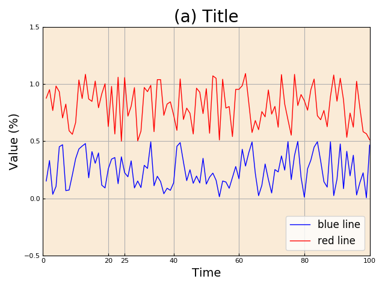

<details>
<summary><strong>  这是一个模板 </strong></summary>

- 添加介绍

- 参考连接 [Color references](http://tableaufriction.blogspot.com/2012/11/finally-you-can-use-tableau-data-colors.html)

```python
video_path = f"{path}/raw_videos"
files = [x for x in os.listdir(video_path) if x.endswith(".MP4")]
```

</details><div align=left></div>

---

<details>
<summary><strong>  Matplotlib画图模板 </strong></summary>

```python
    import matplotlib.pyplot as plt
    import matplotlib.patches as patches #用来画长方形
 
    t = np.linspace(1,100,100)
    data1 = np.random.rand(100)*0.5
    data2 = np.random.rand(100)*0.6+0.5
# STEP1: CREATE FIGURE
    fig = plt.figure(num=None, figsize=(6.4, 4.8), dpi=100, facecolor='w', edgecolor='w')
    # TIP: default figure size is (6.4, 4.8); default dpi is 100;
# STEP2: CREATE AXES
    ax = plt.subplot(111, facecolor='antiquewhite')
    # TIP: set(111) when want to plot one
# STEP3: SET THE PARAS
    lw = 1
    linecolors = plt.get_cmap('Set1').colors # other useful colors: ['coral', 'seagreen', 'darkgrey','orangered','slateblue']
    markers = ['X', '^', 'P', 'd', '*'] # can be '. o v ^ s P + d * x X
    # TIP： uppercase letter means filled markers
    markersize = 6
    xyticksize = 8
    xylabelfontsize = 14
    titlefontsize = 20
    legendfontsize = 12
# STEP4: PLOT THE FIGURE
    t = np.arange(n) #n is the number of points in eachline
    ax.plot(t, AUC_ISF, marker=markers[0], color=linecolors[4], label='IsoForest', lw=lw, ms=markersize)
    ax.plot(t, AUC_IOF,         marker=markers[1], color=linecolors[1], label='IOF',       lw=lw, ms=markersize)
    ax.plot(t, AUC_oneclasssvm, marker=markers[2], color=linecolors[2], label='OSVM',      lw=lw, ms=markersize)
    ax.plot(t, AUC_autoEncoder, marker=markers[3], color=linecolors[3], label='DeepCoder', lw=lw, ms=markersize)
    ax.plot(t, AUC_unDevcoder,  marker=markers[4], color=linecolors[0], label='unDevCoder',lw=lw, ms=markersize)
    ax.legend(loc="lower right", fontsize=legendfontsize)
    # legend set: https: // matplotlib.org / api / _as_gen / matplotlib.pyplot.legend.html
# STEP5: ADJUST THE PLOT
    ax.set_title('(a) Title', fontsize = titlefontsize)
    ax.set_xlabel('Time', fontsize=xylabelfontsize)
    ax.set_ylabel('Value (%)',fontsize=xylabelfontsize)

    ax.set_xlim([0, 100])
    ax.set_ylim([-0.5, 1.5])

    ax.grid(True, axis='both')
    ax.tick_params(axis='both', direction='in', length=3, which='major', labelsize=xyticksize)
    # TIP: axis could be {'x', 'y', 'both'}
    #      grid color, linestyle, linewidth can be adjusted by tick_params

    
    ax.set_xticks([0, 20, 25, 40, 60, 80, 100])
    ax.set_yticks([-0.5, 0, 0.5, 1, 1.5])
    # TIPs: just lock the ticks 
    
    plt.xticks(t, (10, 50, 100, 500, 1000, 5000))
    # TIPs: Arbitrarily change the xticks. t is the values of x axis.
    
    # set empty xticks, yticks
    plt.xticks([])
    plt.yticks([])

# STEP6: Add text or rectangle if needed
    textstr='line1 \n25 line2 \n line3.'
    ax.annotate(textstr,fontsize=annnotefontsize, xy=(50, 1.2), xytext=(75, 0.6),
       arrowprops=dict(facecolor='b', edgecolor='b', width=5, shrink=0.1, alpha=0.5)) # xy是箭头位置，xytext是文本位置，标准为横纵坐标。
    rect = patches.Rectangle(xy=(25, 0.3), width=25, height=1.08, linewidth=1, edgecolor='r', facecolor='none') 
    ax.add_patch(rect) #添加长方形
    
    fig.tight_layout()
    plt.show()
    f.savefig(f"figname.pdf")
    
    
 # how to add leneng for multiple subplots
    fig = plt.figure(num=1,figsize=[10, 3.5])
    ax1 = plt.subplot(121)
    ax2 = plt.subplot(122)
    handles, labels = ax1.get_legend_handles_labels()
    lgd = fig.legend(handles, labels, loc='upper center', ncol=5, labelspacing=0.,bbox_to_anchor=(0.5, 1.1))
    
    fig.tight_layout()
    fig.savefig('k_sensitivity.pdf', bbox_extra_artists=(lgd,), bbox_inches='tight')
```

</details><div align=left></div>

---

